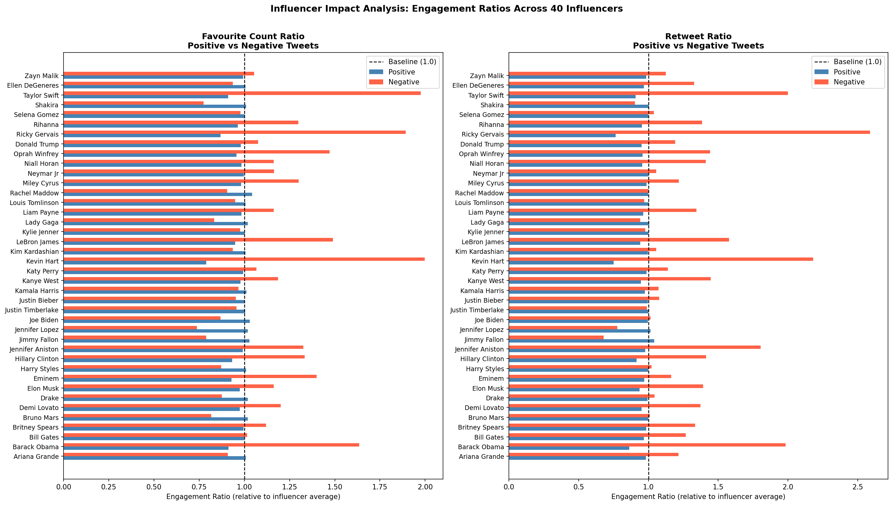
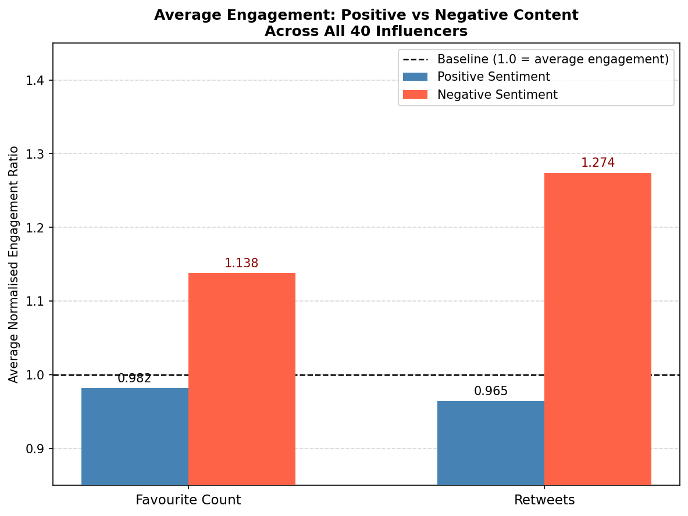
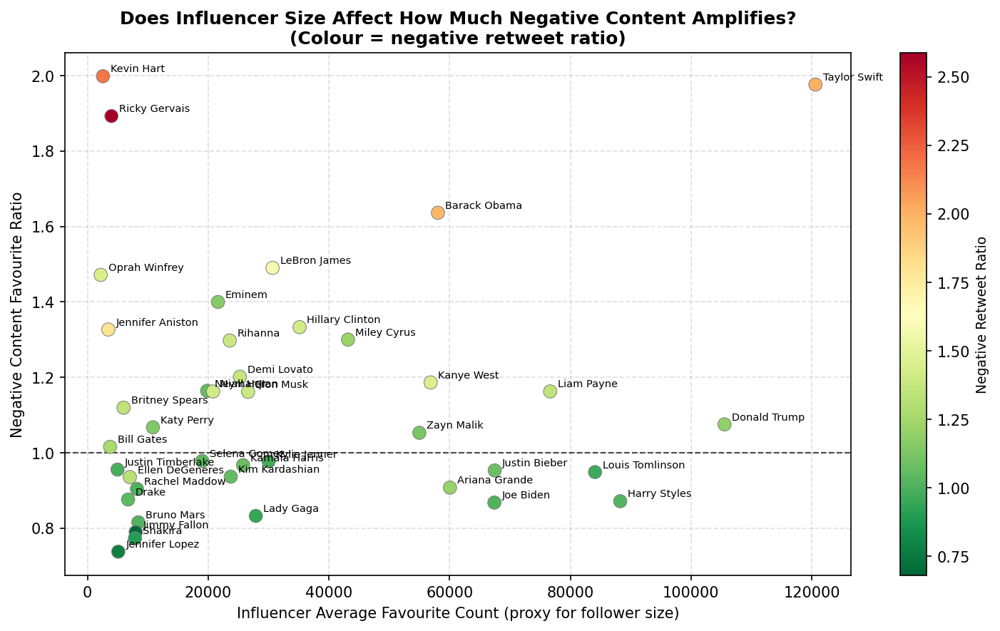

# Influencer Impact Analysis

Analysing how tweet sentiment affects audience engagement across 40 major social media influencers.

## Key Finding

Negative content generates approximately **25% more engagement** than positive content — 
14% more favourites and 28% more retweets — consistently across influencers of all sizes and domains.

## Dataset

- 40 influencers across music, politics, sports and entertainment
- ~50,000 tweets with favourite counts and retweet counts per tweet
- Influencers include: Barack Obama, Taylor Swift, Eminem, Rihanna, Elon Musk, 
  Kim Kardashian, Donald Trump, Ariana Grande and 32 others

## Methodology

1. **Data collection** — Tweets extracted via Twitter API for each influencer
2. **Text cleaning** — URLs, mentions, hashtags and non-alphabetic characters removed
3. **Sentiment scoring** — Each tweet scored using NLTK Opinion Lexicon
4. **Normalisation** — Engagement averages expressed as ratios relative to each 
   influencer's own baseline to account for follower size differences
5. **Aggregation** — Ratios aggregated across all 40 influencers for cross-influencer comparison

## Visualisations

## Results

| Metric | Positive Content | Negative Content |
|---|---|---|
| Favourite Count Ratio | 0.98 | 1.14 |
| Retweet Ratio | 0.96 | 1.28 |

## Tools Used

Python, Pandas, NumPy, NLTK, Matplotlib, Google Colab
